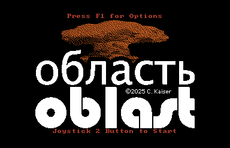
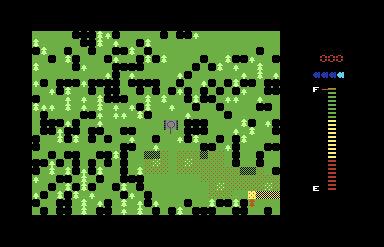
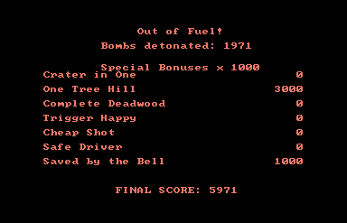

# Oblast

A fast-paced, _highly_ explosive game for the Commodore 64, based on Blasto for the TI 99/4A and arcade Gremlin Blasto. (These games are unrelated to the PlayStation title of the same name.) This was one of my favourite games on the 99/4A and I wanted to make it even better.

Oblast is free to play and freely distributable. However, if you've enjoyed it, [buy me a coffee/Mr Pibb](https://ko-fi.com/classichasclass).

Curious as to how it was developed? [Read more.](https://oldvcr.blogspot.com/2025/12/oblast-better-blasto-game-for-commodore.html)

Copyright 2025, Cameron Kaiser.  
All rights reserved.  
Freeware under the Floodgap Free Software License.

## How to run

1. You'll need either a real Commodore 64, real Commodore 128 in 64 mode, or a 100% compatible emulator like VICE, plus a joystick. Connect the joystick to control port 2. Oblast can run on PAL or NTSC computers.
2. Download Oblast [from the Releases tab](releases/). Oblast is a single `.prg` (program) file that comes in both compressed and uncompressed versions. The compressed version is significantly smaller but takes a few seconds to decompress when run. Although both versions will work on any system, one may be more optimal for your setup than the other. Use the compressed version when loading from a very slow or space-limited medium like a real floppy disk or cassette tape. Use the uncompressed version when loading from a very fast medium, such as an emulator or a cartridge that can load files via DMA like a 1541-Ultimate.
3. Oblast `LOAD`s and `RUN`s like a BASIC program. `LOAD` it from your device (such as `LOAD"OBLAST",9`) and `RUN` it.

## How to play one of the default game modes

When the program starts and the title screen is displayed, press F1 for options, and then select one of the four default game modes with F1, F3, F5 or F7. Most players will select F1 "Regular Duty" or F3 "Hazard Pay" for a standard or a more explosive game. A brief description of the current game rules will appear, and then your tank will be launched into the playfield.

You control the tank using the joystick, which can move up, down, left or right. The tank fires shells with the fire button. Destroy all black bombs onscreen by shooting them; when all bombs are destroyed, you are immediately transported to a new screen. Complete as many screens as you can before your fuel (shown as a gauge) is exhausted. The red digits indicate which screen number you are on.

Bombs set off other immediately adjacent bombs, and those bombs set off those around them and so on, which may trigger a large explosion very quickly. If an explosion hits you, in these two game modes your tank will temporarily go out of control for a few seconds. Your tank will recover but this will use up valuable fuel.

Your tank reloads shells at a fixed rate. The four blue "bullets" show the status of your tank's bullet chambers: a chamber illuminated in cyan is ready to fire, and a dark blue one is spent. The tank automatically reloads spent chambers, though this may take several seconds. If all chambers are spent, you cannot fire until at least one reloads.

While your tank can go anywhere on the playfield, driving over bombs or trees will slow it down.

When your fuel runs out, the game will tally your final score. You receive one point for each bomb detonated (either by shooting it directly or destroying it in a chain reaction). You can also receive a special bonus of 1,000 points for triggering one of up to seven secret conditions on each screen you complete. You can receive multiple special bonuses on a single screen. If you beat the high score, you win an on-screen champion "medal." Congratulations!

After you have completed at least one game, if you want to play again with the same settings, just press the fire button on the title screen instead of F1 and it will "quick start" into a new game right away. Otherwise, you can press F1 for different options.

Game modes F5 and F7 play differently. F5 "More Like Classic Blasto" generates screens more like the classic Blasto game in the arcade and on the TI 99/4A using a similar density of bombs and obstacles. In this mode, your shells recycle right away as soon as they hit something, and the game clears trails for you to move around in, but play is otherwise the same. Some of the special bonuses are disabled in this mode.

F7 "Blow Everything Up Fast" generates extremely bomb-dense screens as a speed challenge for advanced players. In this mode your tank is invulnerable to explosions, and your shells also recycle immediately when they hit something, but your fuel is used up four times faster. Try to clear as many screens as you can in the more limited time you have available. In many screens you can clear nearly the entire field with a single shot. Some of the special bonuses are disabled in this mode.

## How to play a custom game

Instead of pressing F1, F3, F5 or F7 at the main screen, press RETURN. This will bring up the game configuration screen. There are seven options, configured by pressing letters `A` through `G` and entering a new value between 0 and 255:

* Starting level. Oblast can procedurally generate up to 384 levels based on the settings or default you choose. Given the same set of settings, these screens will be the same every time you play. You may start on any level from 0 to 255 and can play on from there.

* Bomb density. Lower values place more bombs on the screen and higher values place fewer. In general, a value 100 or less makes an extremely bomb dense screen, while a value at or above 180 makes a very sparse one.

* Tree density. This is the reverse of bomb density: lower values place _fewer_ trees on the screen and higher values place more. Bombs take priority over trees. A density of 80 or more will generate many trees; a density of 30 or less will generate relatively few.

* Trails. You can have the game automatically clear space for the tank with horizontal strips, vertical strips, or both, or none. This makes the game easier but also reduces the amount of bombs and trees on the screen.

* Fuel rate. This is approximately how long the game waits to advance the fuel gauge from full to empty. In all but the F7 game mode, this value is 40; in the F7 game mode this is 10. If you enter a value of zero, the game will substitute a value of 1.

* Tank takes hits. If you select YES, then the tank is susceptible to explosions. If you select NO, it is unaffected by them.

* Fast cycle shells. If you select YES, then a shell chamber is immediately reloaded as soon as it hits something. If you select NO, then it is reloaded after a few seconds.

You can then press RETURN to play when you have the options you want. If you want to start with one of the defaults and then tweak it, press F1, F3, F5 or F7, and the values for that particular default (except starting level) are loaded into the settings. Changing them on this screen does not change them permanently.

## Hints and tips

Your shells are much faster than you are. It is generally quicker to aim from a distance and fire than to move the tank up close -- assuming your aim is good.

Because the screens are consistent and not random, it is possible to memorize how to clear a specific screen quickly, so keep track of which one you're on. This is especially important for getting a good score in F7 "Blow Everything Up Fast."

An explosion that might not hit you when you're standing still might catch the corner of your tank if you turn, even if you're turning away from the detonation.

No special bonuses are awarded until you actually complete the screen.

Some of the special bonuses are mutually exclusive, so it is impossible to get every single special bonus on any one screen. You can get clues as to what conditions are required not only from their name but also noting which bonuses are disabled in the F5 and F7 game modes. Or you can cheat and look at the game source, cheater. Speaking of game source ...

## How to build

Before building, [read the article](https://oldvcr.blogspot.com/2025/12/oblast-better-blasto-game-for-commodore.html) about how it was written.

This repository contains the source code for Oblast and all of its media assets, including sprites, character sets, graphic screens and music, and also includes the custom tools used to generate its components. You can rebuild or alter the game if you want to change the rules, behaviour or appearance. To build a custom version of Oblast, you must have:

* `make`
* Perl 5
* the [`xa65` crossassembler](http://www.floodgap.com/retrotech/xa/)
* (optional) the [`pucrunch` compressor](https://a1bert.kapsi.fi/Dev/pucrunch/)

To build the game, simply type `make`. The build system will automatically rotate and store the game sprites, assemble the main game source in `game.xa`, tokenize the BASIC stub in `menu.bas`, and merge all of the game code and assets into a single file called `game.arc`. This is the uncompressed build. If `pucrunch` is present, it will then be called to compress `game.arc` into a file stored at `../prg/oblast` (if not, an error will occur which can be ignored). This is the compressed build.

The folder `urmusic` contains unrelocated VoiceTracker files that can be directly changed in the editor. If you adjust them, you will need to relocate them to their expected starting addresses in `game.xa` and ensure they don't overflow the memory range(s) allocated for them (see `MAP.txt` for a complete explanation of how Oblast is laid out in RAM). 

You don't need to do anything special to make private builds for your own use. For example, if you want to change the settings for the four presets, there is a `DATA` statement at the end of the BASIC stub with the values. Modify them and `make` to issue a new build. However, if you choose to distribute a modified Oblast to others or port the game to another platform, please use a different name to avoid confusion, and you must obey all terms of the ...

## License

Oblast is freeware without cost under the Floodgap Free Software License. This license has different terms than some other open-source licenses, and you are strongly encouraged to [read it](LICENSE.txt). All derivative works, including modifications, ports and substantial subsets, are subject to this license.

## Don't make pull requests for new features

I essentially consider this game to be feature-complete. Feature requests, even those accompanied by a pull request, will be ignored or deleted. If you want to add something to the game, feel free to do so in your own fork, subject to the terms above. If I make any feature additions, they will be on no particular timetable, and may never actually happen.

Although you can submit bug reports, and (if provided) pull requests for suggested fixes, bugs (acknowledged, unreproducible or otherwise) may or may not ever be fixed. Submission of a pull request is considered an implicit and unconditional release of all rights to the submitted code to me.

Do not submit bug reports to change to your favourite assembler, or change the code style, or other items of personal preference. These changes, even if accompanied by a pull request, will be ignored or deleted. Please make such changes in your own fork. 